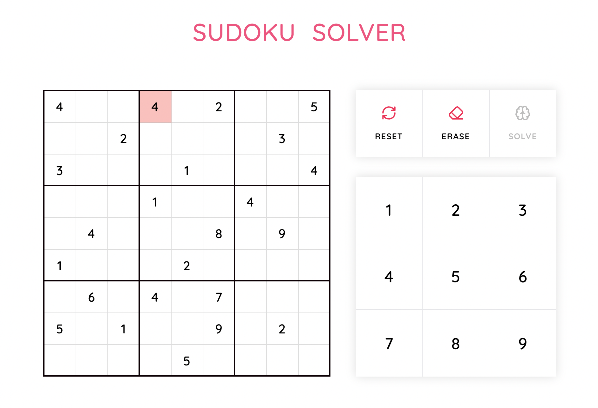

# Sudoku Solver

Welcome to Sudoku Solver, a React-based game that will solve any Sudoku problem you throw at it! With its intuitive UI and dynamic cell updates, you'll be solving puzzles in no time. [Live Link](https://sudoku-henna-seven.vercel.app/)



## Features

- Interactive Sudoku board
- Error highlighting for those pesky mistakes
- Ability to select and update cells with ease, whether you prefer keyboard or mouse

## Installation

Ready to dive in? Here's how to get started:

1. Ensure you have Node.js installed. You can download it from [nodejs.org](https://nodejs.org/).

2. Clone the repository:

   ```bash
   git clone https://github.com/kumbarsumant/sudoku-react-app.git
   ```

3. Navigate to the project directory:

   ```bash
   cd sudoku-react-app
   ```

4. Install the dependencies:

   ```bash
   npm install
   ```

5. Start the development server:

   ```bash
   npm run dev
   ```

6. Open your browser and go to [http://localhost:5173](http://localhost:5173) to view the application.

## Usage

- Click on a cell to select it.
- Enter a number to fill the cell.
- Invalid entries will be highlighted in red.
- The board updates dynamically as you make changes (use keyboard or mouse to update cells).

Thanks for checking out my project! I hope you find it useful and enjoyable.
